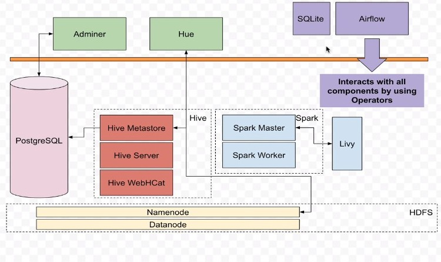

Introduction to Project

# Introduction to Project
## How?
+ Define the DAG and all of the parameters
+ implement tasks
	+ check API
	+ Check the file having the forex pairs to watch
	+ download with python
	+ save to HDFS
	+ store with Hive
	+ process with spark
	+ send email notification
	+ send slack notification

## Architecture
