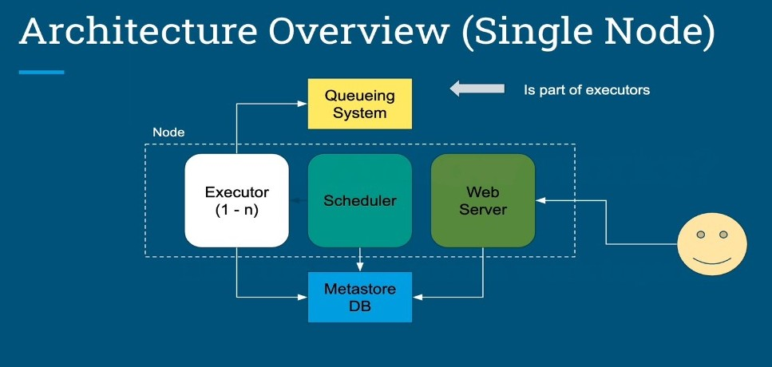
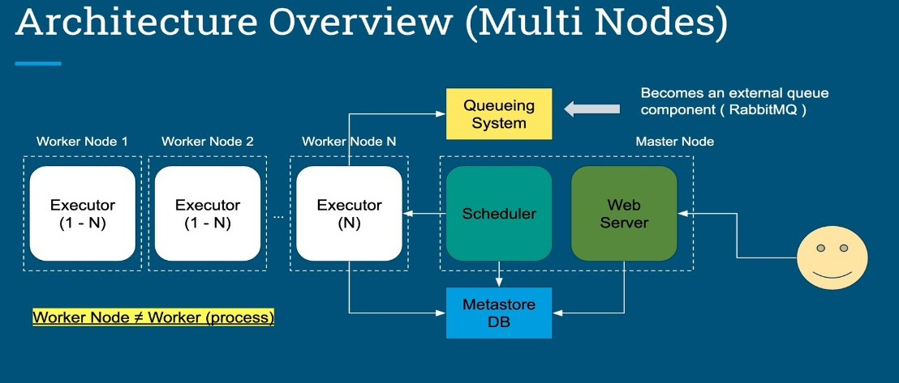

How Airflow Works?

# How Airflow Works?

+ How the components work together
+ Single node and multiple node are different

## Notes about Single Node
+ Queue component is not part of the system, might have to use RabbitMQ or Redis.
+ All executors must have a queue to execute tasks in the right order
+ Scheduler, Webserver, and executor are on the same node
+ Keep metadata DB on separate machine.
+ Exe, Sch, and Web communicate through the database

## Notes about Multi Nodes
+ Difference is master node has scheduler and server
+ MetadataDB runs on its own node
+ Worker nodes execute tasks (has executors)
+ Scales out the worker processes to more nodes, makes it scalable
+ Queuing system runs on another node and is independent of the system
+ __Worker node is a computer, worker is a process in the context of Airflow__

## How work gets done?
+ scheduler reads the dag folder to find DAGs
+ given to child process that creates DagRun object which is given to the metastore DB
+ TaskInstance is instantiated for each task (flagged "Scheduled")
+ scheduler gets all task instances marked "Scheduled", changes state to queued, then sends to executors
+ workers execute the task instance (executor pulls from the queue)
+ sets the status to complete in the DB
+ scheduler reads if success
+ (web server periodically checks the DB for status updates on the task instance)

